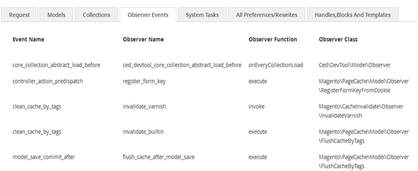

# Magento 2 Developer-Debug Tool by CedCommerce 

**Magento 2 Developer-Debug Tool**, a Magento 2.0 development and debugging extension, which aims at easing developers concerns by fetching vital information for a current page load. The extension users are provided with complete set of data related to a current page request, collections and models called during a page load. Besides this, all observer called events data, along with parent and its extended classes of a page load are viewable by developers. Further, data information on blocks with their respective handle names, and associated template files with full file path is also communicated to the extension users.
However, in the absence of **Magento 2 Developer-Debug Tool**, developers are tasked with tracking of all important data via Magento’s backend. 
The data in the module has been divided into tabs, which can be viewed at module’s bottom page, after it’s being configured from the admin section. Each tab is designed to allow developers to have better understanding on data related to the current page load.

## Tabs and their Utility Features 

- **REQUEST TAB**: shows the **Module, Controller, Action** name of the recently loaded page. Provides accurate **Path Info** of the loaded page, the feature help developers for URL rewriting.

- **MODEL TAB: shows all the **Model Resource Name** and their respective **Class Name** in a sequenced manner to narrate loaded models mechanism during a page load. Also mentions, frequency of instantiated models.

- **COLLECTIONS TAB**: shows all the active collections and its types (Flat/EAV) along with SQL Queries generated during a page load.

- **OBSERVER EVENTS**: shows all events and its details called during page load. Observer details like Observer Name, Observer Function, Observer Class and Observer Frequency of being instantiated are also provided.

- **ALL PREFERENCES/REWRITES**: shows both, all the extended classes and also the classes which extend the classes.

- **HANDLES, BLOCKS AND TEMPLATES**: shows all the block name of the currently loaded page with their respective handle names. Block is responsible for showing path of the template file.

- **SYSTEM TASKS**: this is a special feature as it allows developer to enable or disable Path hints and Cache. Besides, flushing the system cache from Magento 2 frontend only. 

## Compatibility

**Magento 2 Developer-Debug** module is tested on the **2.0.0.0-dev35** version and on **Master branch** of Magento 2.0.  The tool is launched with a goal to help global developers, who are willing to leave no stone unturned in analyzing structure of Magento 2.0.

##Installing and verifying the reference module
You can install the reference module in any of the following ways:

- By copying the code to your <your Magento install dir>/app/code/<PackageName>/<ModuleName> directory.
This method requires some manual tasks but it easy.
- Using composer update.

##Installing the module by copying code
Any Magento module requires a particular directory structure under <your Magento install dir>/app/code. The structure starts with:
< PackageName>/<ModuleName>
The reference module requires the following structure:
Ced/DevTool
To add the module to your Magento installation:

- Log in to your Magento server as a user with privileges to write to the web server docroot (typically either the root user or the web server user).
- Enter the following commands in the order shown:
- cd <your Magento install dir>/app/code
- Go to the reference module GitHub
- Click **Download Zip.**
- Copy the .zip file you downloaded to your Magento server's <magento install dir>/app/code/.
- Enter the following commands in the order shown:
- unzip Magento2-Developer-Debug-Tool-master.zip
- mv Magento2-Developer-Debug-Tool-master/* .
- rm -rf Magento2-Developer-Debug-Tool-master
- Open <your Magento install dir>/app/etc/config.php in a text editor.
- Add the following anywhere under: 'modules' => array (:
- 'Ced_DevTool' => 1,
- Save your changes and exit the text editor.

##Installing the module using Composer

- open cmd/shell and cd upto your magentoRootDirectory
- then run below commands:-
- composer config repositories.ced git https://github.com/cedcommerce/Magento2-Developer-Debug-Tool
- composer require cedcommerce/magento2-developer-debug-tool:*

## Authors, contributors and maintainers

## License

[GPL v3](LICENSE.txt)

